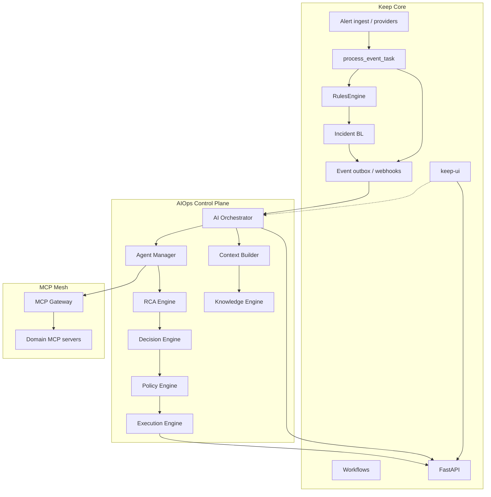

## Intent

We are **evolving Keep into a new AI-native product** that remains compatible with current Keep.

- Keep foundation stays the **system of record** for alerts, incidents, auth, workflows, and integrations
- A first-class **AIOps control plane** adds investigation, RCA, knowledge retrieval, decisioning, and policy-gated execution
- Existing Keep APIs/data/workflows keep working; AI capabilities are additive and optional at adoption time

Related decisions: [ADR-0001](/aiops/adr/0001-sidecar-ai-control-plane) · [ADR-0002](/aiops/adr/0002-mcp-as-tool-bus) · [ADR-0003](/aiops/adr/0003-policy-gated-execution).

## High-level diagram

## Responsibility split

| Plane | Owns |
|-------|------|
| **Keep** | Incident lifecycle, alerts, timeline, RBAC, providers, workflows |
| **AIOps** | Investigations, agents, evidence, RCA, RAG, policies, executions |
| **MCP** | Tool execution boundary with audit |

## Design constraints

- No hard dependency from Keep ingest path to AI plane
- Multi-tenant isolation on every AI query
- OpenTelemetry-first tracing with `investigation_id`
- Prefer extension points over core modification

## Doc map

| Topic | Doc |
|-------|-----|
| Services | [Service decomposition](/aiops/architecture/service-decomposition) |
| Domain | [Domain model](/aiops/architecture/domain-model) |
| Flows | [Data and event flow](/aiops/architecture/data-and-event-flow) |
| APIs | [API design](/aiops/architecture/api-design) |
| Agents/MCP | [Agents and MCP](/aiops/architecture/agents-and-mcp) |
| Security | [Security, tenancy, scale](/aiops/architecture/security-tenancy-scale) |
| Deploy | [Deployment](/aiops/architecture/deployment) |
| Quality | [Observability and testing](/aiops/architecture/observability-testing) |
